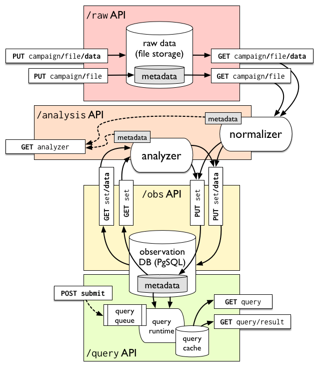

# An Observatory for Path Transparency Measurement

Deploying new protocols in the Internet is hard. 

Though the end-to-end principle and the four-layer TCP/IP architecture suggest
that what happens above the IPv4 or IPv6 header isn't any of the network's
business, the widespread deployment of firewalls, network address translators,
proxies, and other middleboxes at layers 4 and 7 mean that in practice, TCP
usually works, UDP usually works, and for everything else, your mileage may
vary.

The design and implementation of new protocols and protocol extensions, such as
[Multipath TCP](https://tools.ietf.org/html/rfc6824) (MPTCP), must consider the
potential actions of middleboxes in modifying their headers or dropping their
packets, with correspondingly complex fallback code. These design decisions
should be backed up by measurement, though: while it makes sense to detect and
respond to an impairment that happens 1% of the time, it makes less sense to do
so for one that happens on one path in ten million. In addition, as protocol
extensions like MPTCP and [Explicit Congestion
Notification](https://tools.ietf.org/html/rfc3168) (ECN) and new protocols such
as [QUIC](https://datatracker.ietf.org/wg/quic/documents/) see increased
deployment, quantifying and localizing the extent of middlebox-driven
impairments to these protocols is useful to the operations community in
debugging connectivity and performance problems linked to their use.

To this end, the [MAMI project](https://mami-project.eu) has designed the Path
Transparency Observatory (PTO), an open-source and publicly-accesible repository
for measurements of _path transparency_. A path through the Internet is said to
be transparent to a given protocol when packets using that protocol are received
without drops or modification at their destination. The PTO is designed to meet
the goals of _comparability_ and _repeatability_ in a way that is agnostic to
the measurement method for determining the presence of impairments to path
transparency. 

We learned some lessons from a [pilot
release](https://mami-project.eu/index.php/2017/03/01/path-transparency-observatory-pto-goes-live/)
of the PTO in March, which makes a limited dataset available at
[https://observatory.mami-project.eu](https://observatory.mami-project.eu)), and
have gone back to the drawing board for a fully RESTful design for the PTO,
centered around a common data model aimed at path transparency measurements, and
built with "medium data" technologies. 

## Data Model

The observatory is a collection of _observations_, each of which is a statement
that at a given _time_ along a given _path_, a given _condition_ held. Paths are
expressed in terms of IP addresses, prefix, or BGP anonymous system numbers,
allowing multiple resolutions of data depending on the sensitivity of the raw
address information. Conditions are defined in terms of the _feature_ (e.g. ECN,
TCP Fast Open) and the _aspect_ of that feature (e.g. connectivity impairment,
ability to negotiate, ability to signal) they measure. Each feature and aspect
is associated with a number of _states_: for example, the `ecn.connectivity`
aspect has the states `works` (trying to use ECN doesn't have any impact on
connectivity), `broken` (trying to use ECN makes a connection impossible, e.g.
because ECN SYN packets are dropped), or `offline` (no measurement was possible
because the far endpoint wasn't online).  Data in the raw store is normalized
into observations in terms of these conditions and paths, which makes queries
across hetereogeneous source data made by different measurement tools possible,
as long as they are measuring the same aspects of the same features. 

## Design

The PTO is implemented as a RESTful API around two data stores, as shown in the
figure above:

- an _observation_ store, backed by a relational database whose tables implement
  the PTO data model. Observations can be uploaded and downloaded as sets, or
  returned from queries over the entire database. Observations and queries
  thereon are generally made public.

- a _raw data_ store containing unmodified measurement results received as flat
  files from measurement tools such as [PATHspider](https://pathspider.net).
  Normalization and analysis refine this raw data into observations for public
  access. Access to raw data is generally limited to the owner of that data.

Each query over the observation store has metadata referencing the observations
and raw data from which it is derived, and the analyses that ran to derive them.
Each object in the PTO thereby stores its provenance, fostering _repeatability_
of experiments and analyses.

## Results

As reported at [ANRW](https://irtf.org/anrw/2017/anrw17-final16.pdf) in Prague
in July of this year, the normalization and refinement of analysis of path
transparency measurements at scale offered by the PTO has already led to
interesting insights about the nature of path transparency in the Internet.
Impairments to the use of ECN, already found to be rare, appear to be dependent
on the path between the source and destination primarily in jurisdictions with
documented deployments of heterogeneous, TCP-intercepting Internet censorship
infrastructure. Impairment to ECN in the network is therefore most likely a side
effect of deliberate interference with traffic, as opposed to a more difficult
to debug transient accident of middlebox implementation, and therefore less
risky to deploy.

Our current work focuses on using the PTO to join heterogeneous datasets:
determining the extent to which impairments in various protocols are correlated,
and joining conditions measured by PATHspider with AS-level topology and
impairment information to improve localization of impairments in the Internet. 

Public release of our new lightweight PTO will happen in the coming weeks. It is
based on an implementation of a RESTful API in bare [Go](https://golang.org)
(i.e., without any web frameworks), with raw data storage backed by the
filesystem, and observation store in the venerable
[PostgreSQL](https://postgresql.org) RDBMS.
